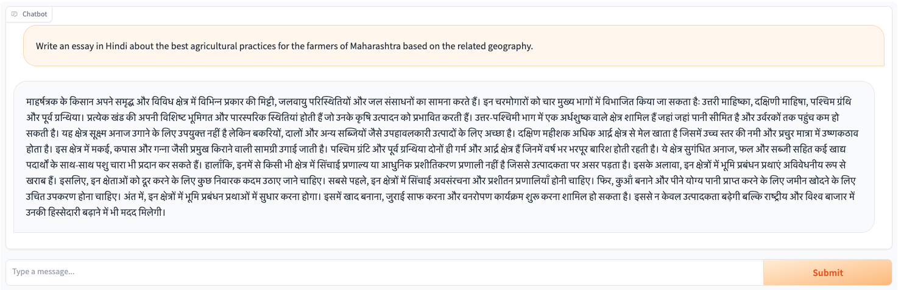
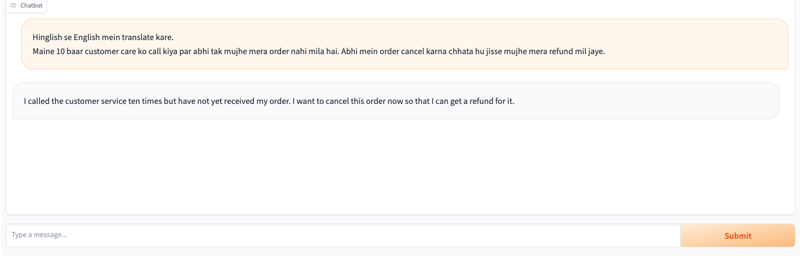
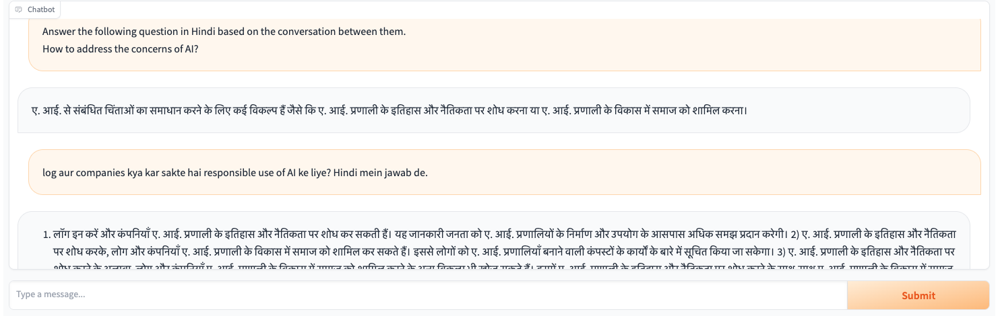

# openhathi_instruct
This repository contains the code for dataset curation and  finetuning of instruct variant of the Bilingual OpenHathi model. The resulting model is meant to follow instructions and chat in Hindi and Hinglish.

This is just the started code.

# Dataset

[smangrul/hindi_instruct_v1](https://huggingface.co/datasets/smangrul/hindi_instruct_v1)

## Hindi Instruct V1 Dataset

This dataset is curated by Sourab Mangrulkar. It was developed on top of `HuggingFaceH4/no_robots` dataset. 
First, the dataset was translated using `ai4bharat/indictrans2-en-indic-1B` SoTA translation model developed by AI4Bharat. 
Here, it is important to note that the sequence length limit is 256 for input and output sequences. 
Hence, I split the individual sentences on full stop and create minibatches for translation and then stitch them back properly.

```python
def chunk_and_translate(content):
    minibatch = content.split(".")
    minibatch = [k for k in minibatch if len(k.strip())>0]
    translations = batch_translate(minibatch, "eng_Latn", "hin_Deva", en_indic_model, en_indic_tokenizer)
    translated_content = " ".join(translations)
    return translated_content

def preprocess(sample):
    for turn in sample["messages"]:
        turn["content"] = chunk_and_translate(turn["content"])
            
    return {"messages": sample["messages"]}


dataset = load_dataset("HuggingFaceH4/no_robots")
dataset
dataset = dataset.map(
    preprocess,
    batched=False
)
```

Next, inspired by the demo given by the Openhathi team [here](https://youtu.be/WKfVzJSDAd8), I did the following:

### Remove Coding samples

After manually going through the coding samples and trying things like having user messages in Hindi while the assistant messages with code snippets in English,
I found that it would still not work because users often give code snippets and prompt the assistant to help with debugging. 
As this would be noise in Hindi instruction tuning, I simply removed all the coding examples.

### Add English and Hinglish instructions to tell the model to reply in Hindi for Engligh user messages and add the CoT prompt `First write in English and then translate to Hindi`

With probability of 0.2, add the prompts `Hindi mein jawab dena.`/`Reply in Hindi.`/`Summarize in Hindi` to the end of user messages in English with the assistant replies in Hindi.
This would help when user writes something in English and prompt the model to reply in Hindi.

For Chain of Thoughts ability, the OpenHathi team used the prompt "First write in English and then translate to Hindi" which leads to better responses.
To enable this, we suffix the prompt `First write in English and then translate to Hindi`/`Pehle English mein likhna, phir Hindi mein translate karna.` to user messages in English and 
processing the assistant message in the template `{english_reply}}\nTranslation of the above into Hindi:\n{translated_hindi_reply}`.

```python
hindi_reply_prompt = "Hindi mein jawab dena."
english_reply_prompt = "{prefix} in Hindi."
cot_prompt = "First write in English and then translate to Hindi"
cot_hindi_prompt = "Pehle English mein likhna, phir Hindi mein translate karna."

def add_system_prompt(sample):
    p = 0.2
    language_p = 0.5
    suffix_hindi_prompt = bernoulli_sample(p)
    suffix_cot_prompt = bernoulli_sample(p)
    use_hindi_reply_prompt = bernoulli_sample(language_p)
    use_hindi_cot_prompt = bernoulli_sample(language_p)

    for i, turn in enumerate(sample["hindi_messages"]):
        if suffix_hindi_prompt:
            if use_hindi_reply_prompt and i%2==0:
                turn["content"] = f"{sample['messages'][i]['content']} {hindi_reply_prompt}"
            elif i%2==0:
                prefix = "Summarize" if sample["category"] == "Summarize" else "Reply"
                turn["content"] = f"{sample['messages'][i]['content']} {english_reply_prompt.format(prefix=prefix)}"
        elif suffix_cot_prompt:
            if use_hindi_cot_prompt and i%2==0:
                turn["content"] = f"{sample['messages'][i]['content']} {cot_hindi_prompt}"
            elif i%2==0:
                turn["content"] = f"{sample['messages'][i]['content']} {cot_prompt}"
            else:
                turn["content"] = f"{sample['messages'][i]['content']}\nTranslation of the above into Hindi:\n{turn['content']}"
                
    return {"hindi_messages": sample["hindi_messages"]}

orig_dataset = orig_dataset.map(
    add_system_prompt,
    batched=False
)
orig_dataset
```

Example outputs:
```bash
[{'content': 'Write a funny, short story about someone who will stop at nothing to go green and reduce their carbon footprint. \n Pehle English mein likhna, phir Hindi mein translate karna.', 'role': 'user'}, {'content': 'Garry has a real green thumb, and taking care of the environment is extremely important to him. He takes every possible step to cut his carbon footprint, and it inspires and mystifies everyone around him in equal measure. Each night before he goes to bed, he cuts off the power to his house so that his electronic devices don’t draw idle power. \n\nAlmost all of his appliances are quite old, as Garry wants to get as much use as possible out of them before contributing to new pollution-generating production. The only exceptions are his new, water-efficient dishwasher and his solar-powered hot water tank. \n\nThe Homeowner’s Association hates Garry because he grows corn on his front lawn. All of his food is locally sourced as much as possible, and he commutes to work on a bike that doesn’t look like it should work. He built it himself out of recycled parts, and it seems to jump and rock like Fred Flinstone’s car. Yet, it stays in one piece and carries him faithfully to work without contributing to pollution. All in all, there’s nothing Garry won’t do to keep his carbon footprint small. \nTranslation of the above into Hindi:\nगैरी का अंगूठा असली में हरा है और पर्यावरण की देखभाल करना उसके लिए बेहद महत्वपूर्ण है। वह अपने कार्बन पदचिह्न को कम करने के लिए हर संभव कदम उठाता है, और यह उसके आसपास सभी लोगों को समान रूप से प्रेरित करता है और रहस्यमयी बनाता है। हर रात सोने से पहले वह अपने घर की बिजली काट देता है ताकि उसके इलेक्ट्रॉनिक उपकरण बेकार बिजली न खींच सकें। उनके लगभग सभी उपकरण काफी पुराने हैं, क्योंकि गैरी नए प्रदूषण पैदा करने वाले उत्पादन में योगदान देने से पहले उनका अधिक से अधिक उपयोग करना चाहते हैं। केवल अपवाद उनके नए, पानी-कुशल डिशवॉशर और उनकी सौर ऊर्जा से चलने वाली गर्म पानी की टंकी हैं। मकान मालिक संघ गैरी से नफरत करता है क्योंकि वह अपने सामने के लॉन में मकई उगाता है। उनका सारा खाना जितना संभव हो सके स्थानीय रूप से प्राप्त किया जाता है, और वह एक ऐसी बाइक पर काम करने के लिए आता है जो ऐसा नहीं लगता कि यह काम करना चाहिए। उन्होंने इसे पुनर्नवीनीकरण भागों से खुद बनाया था, और यह फ्रेड फ्लिनस्टोन की कार की तरह कूदता हुआ प्रतीत होता है। फिर भी, यह एक टुकड़े में रहता है और उसे प्रदूषण में योगदान दिए बिना काम करने के लिए ईमानदारी से ले जाता है। कुल मिलाकर, ऐसा कुछ भी नहीं है जो गैरी अपने कार्बन पदचिह्न को छोटा रखने के लिए न करे।', 'role': 'assistant'}]
----------------------------------------------------------------------------------------------------------------------------------------------------------------------------------------------------------------------------------------------------------------------------------------------------------------------------------------------------------------------------------------------------------------
[{'content': 'Help write a letter of 100 -200 words to my future self for Kyra, reflecting on her goals and aspirations. First write in English and then translate to Hindi', 'role': 'user'}, {'content': "Dear Future Self,\n\nI hope you're happy and proud of what you've achieved. As I write this, I'm excited to think about our goals and how far you've come. One goal was to be a machine learning engineer. I hope you've worked hard and become skilled in this field. Keep learning and innovating. Traveling was important to us. I hope you've seen different places and enjoyed the beauty of our world. Remember the memories and lessons. Starting a family mattered to us. If you have kids, treasure every moment. Be patient, loving, and grateful for your family.\n\nTake care of yourself. Rest, reflect, and cherish the time you spend with loved ones. Remember your dreams and celebrate what you've achieved. Your determination brought you here. I'm excited to see the person you've become, the impact you've made, and the love and joy in your life. Embrace opportunities and keep dreaming big.\n\nWith love,\nKyra\nTranslation of the above into Hindi:\nप्रिय भविष्य स्वयं, मुझे आशा है कि आपने जो हासिल किया है उससे आप खुश और गर्वित हैं। जब मैं यह लिख रहा हूँ, तो मैं अपने लक्ष्यों के बारे में सोचने के लिए उत्साहित हूं और सोचता हूँ कि आप कितनी दूर आ गए हैं। एक लक्ष्य मशीन लर्निंग इंजीनियर बनना था। मुझे आशा है कि आपने कड़ी मेहनत की होगी और इस क्षेत्र में कुशल बनेंगे। सीखते रहें और नवाचार करते रहें। हमारे लिए यात्रा करना महत्वपूर्ण था। मुझे आशा है कि आपने विभिन्न स्थानों को देखा होगा और हमारी दुनिया की सुंदरता का आनंद लिया होगा। यादों और सबक को याद रखें। परिवार शुरू करना हमारे लिए मायने रखता था। अगर आपके बच्चे हैं, तो हर पल को संजो कर रखें। अपने परिवार के लिए धैर्य, प्यार और आभारी रहें। अपना ख्याल रखें। आराम करें, सोचें और अपने प्रियजनों के साथ बिताए समय को संजो कर रखें। अपने सपनों को याद रखें और जो आपने हासिल किया है उसका जश्न मनाएं। आपका दृढ़ संकल्प आपको यहाँ ले आया है। आप जिस व्यक्ति के रूप में उभरे हैं, आपने जो प्रभाव डाला है और आपके जीवन में प्यार और खुशी को देखकर मैं उत्साहित हूं। अवसरों को अपनाएँ और बड़े सपने देखते रहें। प्यार के साथ, कायरा।", 'role': 'assistant'}]
----------------------------------------------------------------------------------------------------------------------------------------------------------------------------------------------------------------------------------------------------------------------------------------------------------------------------------------------------------------------------------------------------------------
[{'content': "Answer the following questions using the passage below:\nWho was Harry Potter written by?\nWho originally published the Harry Potter series?\n\nHarry Potter is a series of seven fantasy novels written by British author J. K. Rowling. The novels chronicle the lives of a young wizard, Harry Potter, and his friends Hermione Granger and Ron Weasley, all of whom are students at Hogwarts School of Witchcraft and Wizardry. The main story arc concerns Harry's conflict with Lord Voldemort, a dark wizard who intends to become immortal, overthrow the wizard governing body known as the Ministry of Magic and subjugate all wizards and Muggles (non-magical people).\n\nThe series was originally published in English by Bloomsbury in the United Kingdom and Scholastic Press in the United States. All versions around the world are printed by Grafica Veneta in Italy.[1] A series of many genres, including fantasy, drama, coming-of-age fiction, and the British school story (which includes elements of mystery, thriller, adventure, horror, and romance), the world of Harry Potter explores numerous themes and includes many cultural meanings and references.[2] According to Rowling, the main theme is death.[3] Other major themes in the series include prejudice, corruption, and madness.[4] Hindi mein jawab dena.", 'role': 'user'}, {'content': 'हैरी पॉटर ब्रिटिश लेखक जे. द्वारा लिखा गया था। के. रालिंग यह श्रृंखला मूल रूप से ब्रिटेन में ब्लूम्सबरी और अमेरिका में स्कॉलास्टिक प्रेस द्वारा प्रकाशित की गई थी।', 'role': 'assistant'}]
----------------------------------------------------------------------------------------------------------------------------------------------------------------------------------------------------------------------------------------------------------------------------------------------------------------------------------------------------------------------------------------------------------------
[{'content': 'Write a summary of this article about Euripides by reducing it to less than 90 words. Change the dating system from B.C. to BCE.\n\nThe Ancient Greeks, particularly the Ancient Athenians, are given the credit for inventing theater itself. As a result of that, theater became part of the culture, as well as everything that went along with it. There are theaters located throughout Ancient Greece. Also as a result of this fact, playwrights began to spring up all over Greece. One of the most well known of these is Euripides, who is especially noted for his tragedies. He is also one of the only playwrights whose work has actually survived. Here is some more information about this famous playwright from Ancient Greece:\n\nInformation About Euripides\n\nEuripides as born in 480 B.C. in Salamis, which is an island in the Saronic Gulf in Greece. It is interesting to note that he was born on the same day as the Battle of Salamis, where the ultimate victory of the Greeks prevented an invasion by the Persian Empire. He died in 406 B.C. in the city-state of Macedonia. His mother’s name was Cleito and his father’s name was Mnesarchus. His father insisted that he should be an athlete. Although his parents valued athletics, however, he wasn’t restricted in his education. He also learned artistic pursuits, such as painting, as well as philosophy from masters such as Anaxagorus. He was also a dancer and torch bearer at the rites of Apollo Zosterius. Later on, it was clear that he had a knack for the stage and he eventually began writing the plays he was most famous for.\n\n\nHis personal life, however, wasn’t as successful as his professional one. He was actually married twice and in both instances, his wives weren’t faithful to him. He also had three sons from one of these marriages. After this happened, he moved to a cave in Salamis because he wanted to live alone. Referred to as the Cave of Euripides, after his death his followers started a shrine in his honor.\n\nWorks of Euripides\n\nThere is actually some debate as to how many plays there are that were written by Euripides that we know of. Some sources say that there are 95, others say that there are 92. One thing is certain, however, is that his impact on theater is vast and his plays are still being performed today. Of these plays, a much smaller number survived in its complete form. Only about eighteen or nineteen of his plays had been found in their entirety. Besides the fact that his plays have been entertaining people for centuries, his work has also influenced playwrights through the ages. In other words, his artistic legacy has survived the ages.\n\nEuripides was also a contemporary of two other famous playwrights. Sophocles’ first play deputed thirteen years before his, and Aeschylus’s masterwork, Oresteia, debuted three years before Euripides’ first play was released.\n\nAs you can see, Euripedes has had a big impact on theater not only in Ancient Greece, but in the whole world. Sure, theater was invented in Ancient Greece, but the works of people like Euripides is everlasting and they’re still being performed today. Summarize in Hindi.', 'role': 'user'}, {'content': 'प्राचीन यूनानी नाटककार यूरिपिड्स का जन्म 480 ईसा पूर्व में ग्रीक द्वीप सलामिस में हुआ था। युवावस्था में उन्होंने एथलेटिक्स, दर्शन और चित्रकला का अध्ययन किया। वह भगवान अपोलो के संस्कारों के दौरान एक मशाल वाहक और नर्तक थे। हालाँकि इस बात पर सवाल हैं कि उन्होंने कितने नाटक लिखे, उनमें से 18 या 19 आज भी पूर्ण रूप में जीवित हैं। अपनी दूसरी असफल शादी के बाद, उन्होंने सलामिस पर एक गुफा में निवास किया जिसे अब यूरिपिड्स की गुफा कहा जाता है। 406 ईसा पूर्व में उनकी मृत्यु हो गई जो अब मैसेडोनिया है।', 'role': 'assistant'}]
----------------------------------------------------------------------------------------------------------------------------------------------------------------------------------------------------------------------------------------------------------------------------------------------------------------------------------------------------------------------------------------------------------------
[{'content': 'Can foxes fit down rabbit burrows? Reply in Hindi.', 'role': 'user'}, {'content': 'लोमड़ी खरगोश के बिलों में फिट नहीं हो सकते हैं, लेकिन यह उन्हें कोशिश करने से नहीं रोकता है। एक लोमड़ी जितना संभव हो उतना नीचे जाएगी और फिर खरगोश को पकड़ने और उसे बाहर निकालने के प्रयास में अपने अर्ध-वापस लेने योग्य पंजों का उपयोग करके खुदाई करेगी।', 'role': 'assistant'}]
----------------------------------------------------------------------------------------------------------------------------------------------------------------------------------------------------------------------------------------------------------------------------------------------------------------------------------------------------------------------------------------------------------------
```

### Hinglish (Code-Mixing and Transliteration) for colloquial usage

We use the below prompts with the following datasets `HinGE` and `https://github.com/google-research-datasets/Hinglish-TOP-Dataset` for adding samples that does different combinations of translations between English, Hindi and Hinglish.

```python
english_to_hinglish_prompt_en = "Translate the following from English into Hinglish."
hingligh_to_english_prompt_en = "Translate the following from Hinglish into English."
english_to_hinglish_prompt_hn = "English se Hinglish mein translate kare."
hingligh_to_english_prompt_hn = "Hinglish se English mein translate kare."
hindi_to_hinglish_prompt_hi = "निम्नलिखित का हिंदी से हिंग्लिश में अनुवाद करें।"
hingligh_to_hindi_prompt_hi = "निम्नलिखित का हिंग्लिश से हिंदी में अनुवाद करें।"
hindi_to_hinglish_prompt_hn = "Hindi se Hinglish mein translate kare."
hingligh_to_hindi_prompt_hn = "Hinglish se Hindi mein translate kare."

def format_to_norobots(sample):
    p = 0.25
    language_p = 0.5
    ranom_num = random.random()
    use_hn_prompt = bernoulli_sample(language_p)

    hindi_messages = []
    if ranom_num<= 0.25:
        #en_to_hn
        if use_hn_prompt:
            user_message = {"content":f"{english_to_hinglish_prompt_hn}\n{sample['English']}", "role": "user"}
        else:
            user_message = {"content":f"{english_to_hinglish_prompt_en}\n{sample['English']}", "role": "user"}
        asst_message = {"content":sample["Hinglish"], "role": "assistant"}
        hindi_messages.extend([user_message, asst_message])
    elif ranom_num<= 0.5:
        #hn_to_en
        if use_hn_prompt:
            user_message = {"content":f"{hingligh_to_english_prompt_hn}\n{sample['Hinglish']}", "role": "user"}
        else:
            user_message = {"content":f"{hingligh_to_english_prompt_en}\n{sample['Hinglish']}", "role": "user"}
        asst_message = {"content":sample["English"], "role": "assistant"}
        hindi_messages.extend([user_message, asst_message])
    elif ranom_num<= 0.75:
        #hi_to_hn
        if use_hn_prompt:
            user_message = {"content":f"{hindi_to_hinglish_prompt_hn}\n{sample['Hindi']}", "role": "user"}
        else:
            user_message = {"content":f"{hindi_to_hinglish_prompt_hi}\n{sample['Hindi']}", "role": "user"}
        asst_message = {"content":sample["Hinglish"], "role": "assistant"}
        hindi_messages.extend([user_message, asst_message])
    else:
        #hn_to_hi
        if use_hn_prompt:
            user_message = {"content":f"{hingligh_to_hindi_prompt_hn}\n{sample['Hinglish']}", "role": "user"}
        else:
            user_message = {"content":f"{hingligh_to_hindi_prompt_hi}\n{sample['Hinglish']}", "role": "user"}
        asst_message = {"content":sample["Hindi"], "role": "assistant"}
        hindi_messages.extend([user_message, asst_message])

    return {"category": "Transliteration and Code Mixing", "hindi_messages": hindi_messages}
```

Example output:
```bash
[{'content': 'Hinglish se English mein translate kare.\nMere liye reminder set karo to wake up at 6:30 am tomorrow.',
   'role': 'user'},
  {'content': 'Set a reminder for me to wake up at 630 am tomorrow.',
   'role': 'assistant'}]
```


### Add the Hindi specific System prompt 
With 0.2 probability, we add the system prompt `You are a native Hindi speaker who can converse at expert level in both Hindi and colloquial Hinglish`.

```python
system_prompt = "You are a native Hindi speaker who can converse at expert level in both Hindi and colloquial Hinglish."
def add_system_prompt(sample):
    p = 0.2
    add_system_message = bernoulli_sample(p)
    first_message = sample["hindi_messages"][0]
    if add_system_message:
        if first_message["role"] == "system":
            first_message["content"] = f"{first_message['content']} {system_prompt}"
        else:
            system_message = {'content': system_prompt, 'role': 'system'}
            sample["hindi_messages"].insert(0, system_message)
    return {"hindi_messages": sample["hindi_messages"]}
```

Example output:
```bash
{'category': 'Generation',
 'hindi_messages': [{'content': 'You are a native Hindi speaker who can converse at expert level in both Hindi and colloquial Hinglish.',
   'role': 'system'},
  {'content': 'Help write a letter of 100 -200 words to my future self for Kyra, reflecting on her goals and aspirations. First write in English and then translate to Hindi',
   'role': 'user'},
  {'content': "Dear Future Self,\n\nI hope you're happy and proud of what you've achieved. As I write this, I'm excited to think about our goals and how far you've come. One goal was to be a machine learning engineer. I hope you've worked hard and become skilled in this field. Keep learning and innovating. Traveling was important to us. I hope you've seen different places and enjoyed the beauty of our world. Remember the memories and lessons. Starting a family mattered to us. If you have kids, treasure every moment. Be patient, loving, and grateful for your family.\n\nTake care of yourself. Rest, reflect, and cherish the time you spend with loved ones. Remember your dreams and celebrate what you've achieved. Your determination brought you here. I'm excited to see the person you've become, the impact you've made, and the love and joy in your life. Embrace opportunities and keep dreaming big.\n\nWith love,\nKyra\nTranslation of the above into Hindi:\nप्रिय भविष्य स्वयं, मुझे आशा है कि आपने जो हासिल किया है उससे आप खुश और गर्वित हैं। जब मैं यह लिख रहा हूँ, तो मैं अपने लक्ष्यों के बारे में सोचने के लिए उत्साहित हूं और सोचता हूँ कि आप कितनी दूर आ गए हैं। एक लक्ष्य मशीन लर्निंग इंजीनियर बनना था। मुझे आशा है कि आपने कड़ी मेहनत की होगी और इस क्षेत्र में कुशल बनेंगे। सीखते रहें और नवाचार करते रहें। हमारे लिए यात्रा करना महत्वपूर्ण था। मुझे आशा है कि आपने विभिन्न स्थानों को देखा होगा और हमारी दुनिया की सुंदरता का आनंद लिया होगा। यादों और सबक को याद रखें। परिवार शुरू करना हमारे लिए मायने रखता था। अगर आपके बच्चे हैं, तो हर पल को संजो कर रखें। अपने परिवार के लिए धैर्य, प्यार और आभारी रहें। अपना ख्याल रखें। आराम करें, सोचें और अपने प्रियजनों के साथ बिताए समय को संजो कर रखें। अपने सपनों को याद रखें और जो आपने हासिल किया है उसका जश्न मनाएं। आपका दृढ़ संकल्प आपको यहाँ ले आया है। आप जिस व्यक्ति के रूप में उभरे हैं, आपने जो प्रभाव डाला है और आपके जीवन में प्यार और खुशी को देखकर मैं उत्साहित हूं। अवसरों को अपनाएँ और बड़े सपने देखते रहें। प्यार के साथ, कायरा।",
   'role': 'assistant'}]}
```

# Training 

Code in `training/OpenHathi_Instruct.ipynb` uses PEFT for QLoRA, uses TRl for SFT Trainer. Trained on Google Colab with A100 40GB GPU.
The finetuned model is [smangrul/OpenHathi-7B-Hi-v0.1-Instruct](https://huggingface.co/smangrul/OpenHathi-7B-Hi-v0.1-Instruct)

# Inference
Code in `chatbot/Openhathi_Instruct_Chatbot.ipynb` uses Google Colab T4 16GB GPU aand Gradio for creating the chatbot with streaming generation capability.

Few sample generations:






